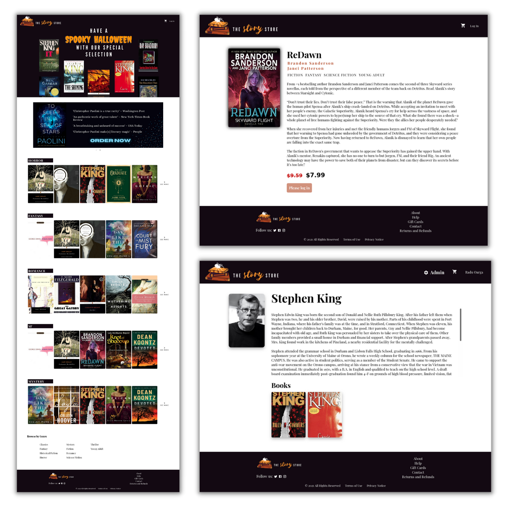
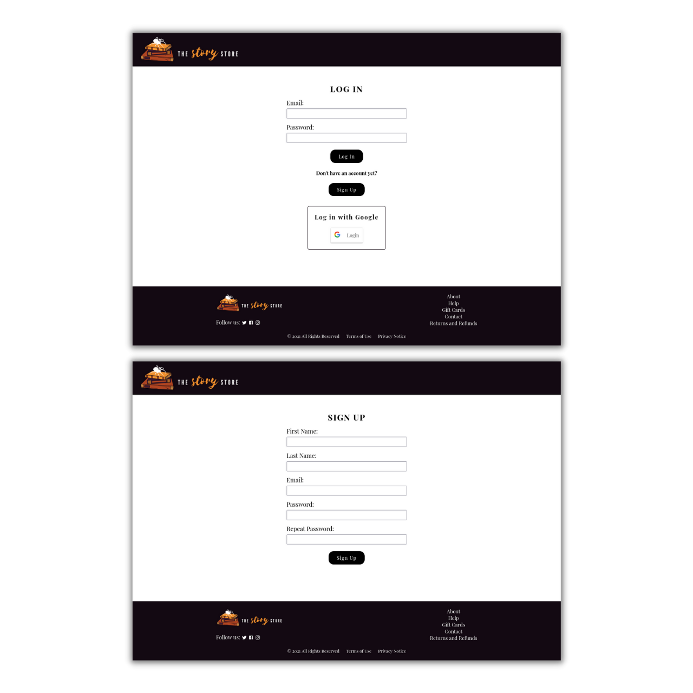
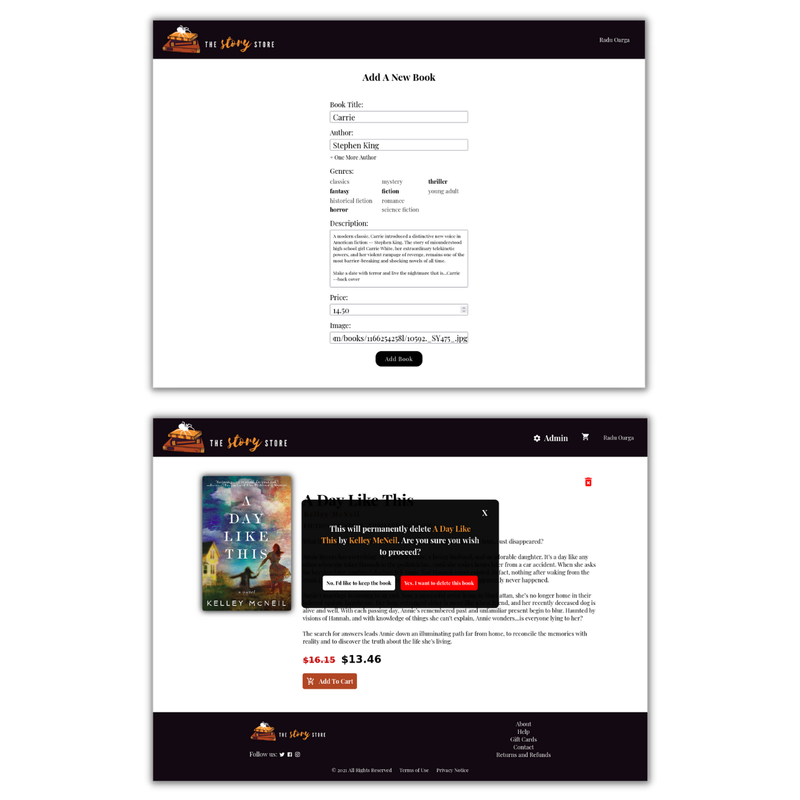
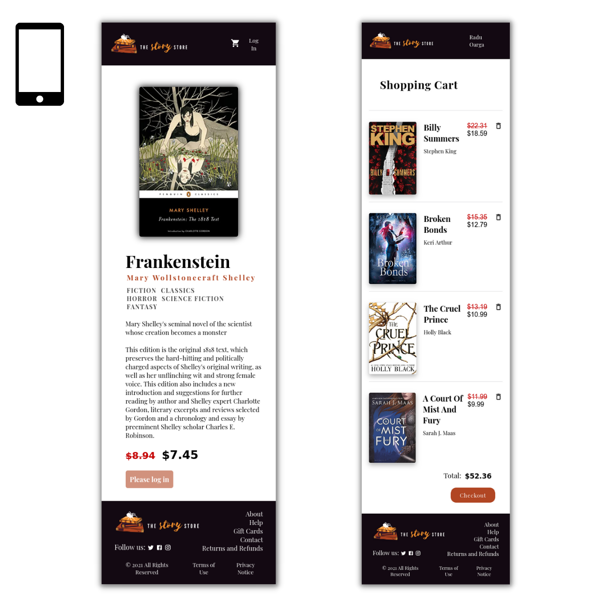

<h1 align="center">The Story Store - Full-Stack Project</h1>

This was my submission for our Full-Stack assignment in the _Integrify International Academy Full-Stack Program_. For this project, I both created the database and built an online book store around it.

## Table of contents

- [Overview](#overview)
  - [The assignment](#the-assignment)
  - [Features](#features)
  - [Links](#links)
- [My process](#my-process)
  - [Built with](#built-with)
  - [Styled with](#styled-with)
  - [What I learned](#what-i-learned)
  - [Continued development](#continued-development)
  - [Useful resources](#useful-resources)
- [Author](#author)
- [Acknowledgments](#acknowledgments)

## Overview

### The assignment

For this project, we were required to create a database for either an online library or an ecommerce website. Being a fan of books, I decided to mix the options and create an online book store. In order to accomplish this, I had to create all the routes, models, controllers for my future books, authors, and users.

Of course, the second part of the assignment supposed building the front-end around my newly coded database.

I created a database with MongoDB and built a responsive online book store around it. The website allows users to register and log in, browse novels, display book and author information, and add products to cart. Administrators can add new books and authors to the database through the website, as well as delete books.

### Features

On this website, **users** can:

- create accounts and log in both with their Google account and through my own local authentication system
- browse books based on their genre
- access specific information about each book or author
- add books to cart

In addition, **administrators** can

- add books and authors to the database through the interface
- delete books

### Links

- Live Site URL: [The Story Store](https://thestorystore.netlify.app/)

## My process

### Built with

- [NodeJS](https://nodejs.org/en/)
- [ExpressJS](https://expressjs.com/)
- [MongoDB](https://www.mongodb.com/)
- [Mongoose](https://mongoosejs.com/)
- [React](https://reactjs.org/)
- [Typescript](https://www.typescriptlang.org/)
- [Redux](https://redux.js.org/)

### Styled with

- CSS
- [Styled Components](https://styled-components.com/)

### What I learned

This project was a great opportunity to learn a lot about the MERN stack. Developing the database was definitely a challenge, but one that pushed my skills to expand.

I was particularly happy to work on authentication, which was a first for me, but I found it fascinating.

I tried to dedicate equal attention to the front-end side of the project. I designed and styled the website myself, meaning to make it look as professional as possible -- like a store I could see myself buying from.

### Continued development

Here are some features I still plan to implement:

- a searchbar that allows to find both books and authors
- editing permission for administrators, so that they can edit book or author information directly on the website

## Author

<!-- - Website - [Sebastian-Radu Oarga](to be added) -->

- LinkedIn - [Sebastian-Radu Oarga](https://www.linkedin.com/in/sebastianoarga/)
